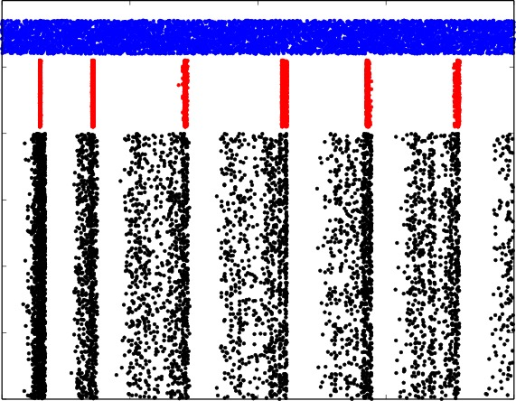
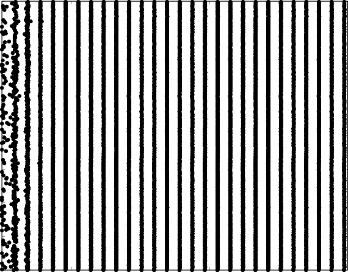
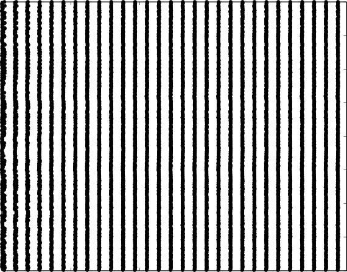

# These BRIAN/NEST/NEURON scripts associated with paper (manuscript):
Ruben A. Tikidji-Hamburyan, Vikram Narayana, Zeki Bozkus, and Tarek A. El-Ghazawi
**Software for Brain Network Simulations: A Comparative Study**

We deeply appreciate the comments of reviewer Marcel Stimberg, which allowed us to significantly improve the quality of the code.
To use theses scripts you need python libraries:
- numpy
- scipy
- matplotlib
- LaTeX for correct graphical interface

and simulators:
- NEURON Release 7.4 (1370:16a7055d4a86) 2015-11-09
- NEST version 2.12.0.
- BRIAN version 2.0.1

Under Ubuntu or any other Debian based Linux, run
```
sudo apt-get install python-numpy python-scipy python-matplotlib texlive-full cython
```

You can use yum or zymm under RadHad or SUSE based Linux distributions.

You may also use `sudo pip install numpu scipy matloblib cython` in any distribution.

Follow instructions for installation NEURON, NEST and BRIAN simulators.

---

## Case Study 1
To obtain results of the Case Study 1, cd into directory CaseStudy1-5000LIF
``
cd CaseStudy1-5000LIF
``
and run simulations
``
./Benchmark.sh
``
The raster diagrams for each software will be shown.

|BRAIN|NEST |NEURON|
|-|-|-|
||||

Statistics of software performance and number of lines and characters in corresponding modules and scripts will printed out in standard output. This statistics was used to obtained results of the case study.

### Files in this directory:
- Benchmark.sh – script helper
- BenchmarkAndMemory.sh – same as Benchmark.sh but with memory usage estimation.
- ee.ssv - E-E neuron connectivity
- ei.ssv - E-I neuron connectivity
- ie.ssv - I-E neuron connectivity
- ii.ssv - I-I neuron connectivity
- se.ssv - S-E neuron connectivity
 -input.ssv - input pattern
- BRIAN/example.py – script for BRIAN
- NEST/example.py – script for NEST
- NEST/iaf_psc_delta.h – module of LIAF, header (*)
- NEST/iaf_psc_delta.cpp – module of LIAF, c++ code (*)
- NEURON/example.py – script for NEURON
- NEURON/intfire1.mod – module of LIAF (*)
- NEURON/vecevent.mod – module for input generator

## Case Study 2

### Note.
**NEST module hh_psc_alpha does NOT completely implement the system of differential equations (2) in the paper.
This module has a synaptic model with an injected current instead of a model with reversal potential and conductance.
The difference slightly reduces the computational load for the NEST benchmark and does not affect any results of Case Study 2.
This inaccuracy was found after the publication. The authors have posted this note to prevent further confusion.**

To obtain results of the Case Study 2, cd into directory CaseStudy2-400HH
```
cd CaseStudy2-400HH
```
and run simulations
```
./Benchmark.sh
```
The raster diagrams for each software will be shown.

|BRAIN|NEST |NEURON|
|-|-|-|
||||

Statistics of software performance and number of lines and characters in corresponding modules and scripts will printed out in standard output. This statistics was used to obtained results of the case study.

### Files in this directory:
- Benchmark.sh – script helper
- BenchmarkAndMemory.sh – same as Benchmark.sh but with memory usage estimation.
- connections.ssv - network connectivity
- volt.ssv – voltage initial condition
- BRIAN/example.py – script for BIRAK
- NEST/example.py – script for NEST
- NEST/hh_psc_alpha.h – module of HH, header (*)
- NEST/hh_psc_alpha.cppmodule of HH, c++ code (*)
- NEURON/example.py – script for NEURON
- NEURON/expsyn.mod – module of double exponential synapses (*)
- NEURON/exp2syn.mod – module of double exponential synapses (*)
- NEURON/hh.mod – module for HH currents (*)

(*) _files are not required for simulation, but used for code complexity study. These files were copied from NEURON/NEST source code and cleaned from comments, empty lines etc._